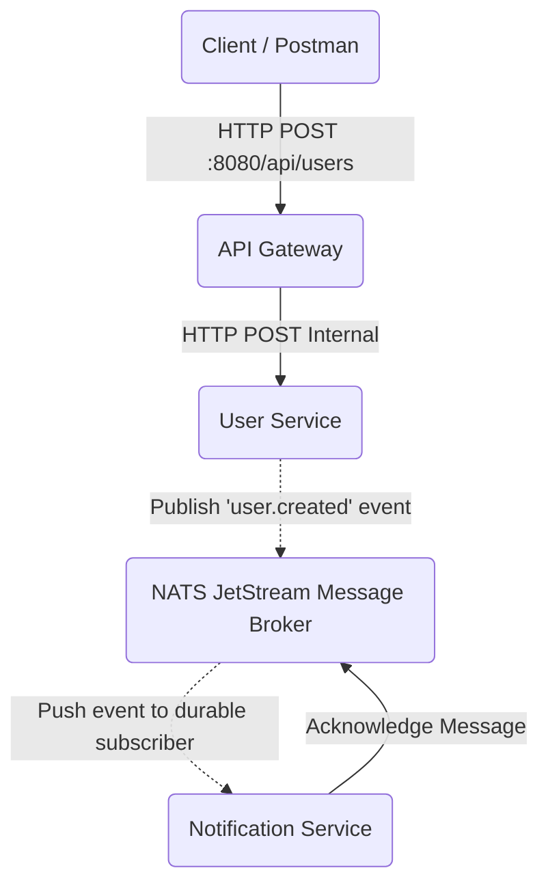

# Microservices Backend Assignment

A microservices-based system consisting of an API Gateway, User Service, and Notification Service, using NATS JetStream for secure, reliable, and asynchronous event-driven communication.

## Architecture Diagram

