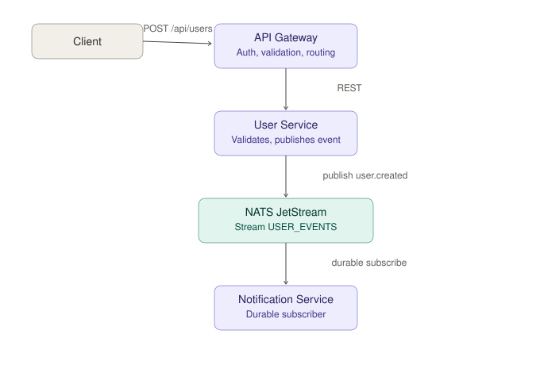

# Microservices-Based Backend

A small microservices system built for the Trams backend internship assignment. It consists of an API Gateway and two backend services that communicate asynchronously over NATS JetStream (no REST or WebSockets between services).

## Architecture



Text version, for a quick read without loading the image:

```
Client
  │
  │  POST /api/users  (X-API-Key required)
  ▼
API Gateway (FastAPI, :8080 → 8000)
  │
  │  REST call: POST /users
  ▼
User Service (FastAPI, :8000)
  │
  │  publish "user.created" event
  ▼
NATS JetStream (stream: USER_EVENTS, subject: user.*)
  │
  │  durable subscription
  ▼
Notification Service (background consumer, no exposed port)
```

- **API Gateway** — the only service exposed to clients. Validates the request, checks the API key, and forwards it to the User Service over HTTP.
- **User Service** — validates and accepts the user payload, then publishes a `user.created` event to NATS JetStream. It does not talk to the Notification Service directly.
- **Notification Service** — has no HTTP interface. It subscribes to the `user.created` subject on the `USER_EVENTS` stream and processes events asynchronously (currently simulates sending a welcome email).
- **NATS JetStream** — the message broker. Provides persistence and durable consumers, so events aren't lost if the Notification Service is temporarily down.

Client-to-gateway and gateway-to-user-service communication is REST (required, since the gateway has to expose an HTTP API to the outside world). User Service → Notification Service communication is entirely event-driven over NATS, satisfying the no-REST/no-WebSocket requirement between the two backend services.

## Prerequisites

- Docker and Docker Compose

## Setup

1. Clone the repo:
   ```bash
   git clone https://github.com/Syed-Farzan/microservices_based_backend
   cd microservices_based_backend
   ```

2. Create a `.env` file in the project root:
   ```dotenv
   NATS_URL=nats://nats:4222
   USER_SERVICE_URL=http://user_service:8000
   API_KEY=your-secret-key-here
   ```

3. Build and start all services:
   ```bash
   docker-compose up --build -d
   ```

4. Confirm everything is healthy:
   ```bash
   docker-compose ps
   ```
   `nats` should show as `healthy`, and `api_gateway`, `user_service`, `notification_service` should show as running.

## Running Locally

All four services (NATS + 3 app services) start together via Docker Compose — no separate local setup is needed. To rebuild a single service after a code change:

```bash
docker-compose up --build -d <service_name>
```

To view logs for a specific service:

```bash
docker logs -f microservices_based_backend-<service_name>-1
```

To stop everything:

```bash
docker-compose down
```

## API Documentation

### `POST /api/users`

Creates a new user. Routed through the API Gateway, which forwards the request to the User Service.

**Headers**

| Header        | Required | Description                          |
|---------------|----------|--------------------------------------|
| `Content-Type`| Yes      | `application/json`                   |
| `X-API-Key`   | Yes      | Must match the `API_KEY` env var     |

**Request body**

```json
{
  "name": "Jane Doe",
  "email": "jane.doe@example.com"
}
```

**Responses**

| Status | Meaning                                              |
|--------|-------------------------------------------------------|
| 200    | User created; event published to NATS                |
| 401    | Missing or invalid `X-API-Key`                        |
| 422    | Request body failed validation (e.g. malformed email) |
| 503    | User Service is unreachable                            |

**Example**

```bash
curl -X POST http://localhost:8080/api/users \
  -H "Content-Type: application/json" \
  -H "X-API-Key: your-secret-key-here" \
  -d '{"name": "Jane Doe", "email": "jane.doe@example.com"}'
```

Interactive Swagger docs are also available at `http://localhost:8080/docs` (API Gateway) and `http://localhost:8000/docs` (User Service directly, for internal testing).

### Event: `user.created`

Published by the User Service to NATS JetStream (stream `USER_EVENTS`, subject `user.created`) whenever a user is created. Consumed by the Notification Service via a durable subscription, so events are retained and redelivered if the consumer is temporarily offline.

**Payload**

```json
{
  "name": "Jane Doe",
  "email": "jane.doe@example.com",
  "id": "USR-999"
}
```

## Notes

- The `nats` image is pinned to `nats:2.10-alpine` rather than `latest`, since the Alpine build includes the tools needed for the Docker healthcheck.
- Both the User Service and Notification Service independently ensure the `USER_EVENTS` stream exists before publishing/subscribing, so either can start first without a race condition.
